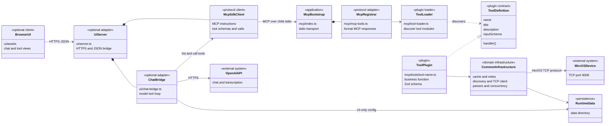

# micrOSMCP Agent Guide

This repository is a TypeScript MCP server with a small local tester UI. Keep this file focused on architecture and contributor workflow. Feature-level tool behavior belongs in `README.md`.

## Architecture Boundaries

- `mcp/` owns the standalone MCP stdio server and micrOS tool implementation.
- `mcp/index.ts` is only the stdio MCP bootstrap.
- `mcp/mcp-tools.ts` is the generic MCP registrar and response formatter.
- `mcp/tools.ts` is the public barrel for micrOS tool functions, tool definitions, and shared types.
- `mcp/description.md` owns server-level MCP instructions loaded at startup.
- `mcp/tool-loader.ts` owns dynamic tool discovery from `mcp/tools/`.
- `mcp/tool-registry.ts` is a compatibility export for loaded tool definitions.
- `mcp/tool-definition.ts` owns the shared `McpToolDefinition` type and file-backed description loading.
- `mcp/tools/common.ts` owns shared micrOS infrastructure: cache access, device selection helpers, TCP socket client, discovery helpers, output parsers, and concurrency helpers.
- `mcp/tools/<tool-name>.ts` owns one tool's input type, Zod schema, exported business function, and exported tool definition. The file basename is converted to the MCP tool name and title.
- `mcp/tools/<tool-name>.md` owns that tool's MCP description and is loaded automatically by `defineTool(import.meta.url, ...)`.
- `ui/` owns the local tester web app, including its server bridge and static assets. It should consume MCP schemas instead of duplicating tool knowledge.
- `ui/chat-system-prompt.md` owns the tester chat's system prompt and is loaded by `ui/chat-bridge.ts`.
- `data/` owns local runtime state such as the device cache and optional tester UI chat config.
- `scripts/` contains operational entrypoints and checks. Keep scripts protocol-safe when used by stdio MCP clients.

## High-Level Architecture

The MCP server is the product boundary. Tools are file-based plugins discovered and registered at startup. The tester UI is an optional adapter that starts the same standalone server as a child process and communicates with it only through MCP stdio; it must not import tool implementations or recreate their schemas.

Separation rules:

- The MCP core must run without `ui/`; `mcp/index.ts` remains a protocol-safe stdio entrypoint.
- Tool plugins depend on the shared plugin contract and `mcp/tools/common.ts`, not on the UI.
- The UI consumes server instructions, tool schemas, and tool results from the MCP client connection.
- UI-only concerns such as HTTPS certificates, browser assets, OpenAI chat orchestration, and chat preferences stay under `ui/` and `data/`.
- Adding a tool must not require changes in the UI; MCP discovery and exposed schemas drive both tool forms and chat tool calling.

## Adding A Tool

1. Add `mcp/tools/<tool-name>.ts`.
2. Define the tool input type in that file unless it is genuinely shared.
3. Export a plain async business function.
4. Export an `McpToolDefinition` beside the function with `defineTool(import.meta.url, { inputSchema, handler })`.
5. Add `mcp/tools/<tool-name>.md` with the MCP-facing tool description.
6. Export the function, input type, and definition from `mcp/tools.ts` when direct imports are useful.
7. Update `README.md` only with user-facing feature details.
8. Run `npm run start:test` for focused contract tests and project entrypoint checks.

## Response Shape

- Tool handlers should return JSON-serializable objects.
- Controlled failures should return `{ ok: false, error: "..." }`.
- Successful side-effecting or command tools should include enough context for users to audit what happened.
- `mcp/mcp-tools.ts` is responsible for wrapping handler results into MCP text content and marking controlled failures as MCP errors.

## Code Style

- Keep MCP schema descriptions concise and human-readable; they appear in clients and in the tester UI.
- Do not duplicate schema metadata in the UI. The UI should render what MCP exposes.
- Keep reusable micrOS protocol behavior in `mcp/tools/common.ts`; keep tool-specific orchestration in the tool file.
- Add comments only around non-obvious protocol behavior, socket lifecycle, or safety-sensitive command behavior.
- Preserve the stdio contract: MCP mode must not print non-protocol helper text to stdout.
- Prefer `npm run start:test` for the minimal local verification pass.

## Documentation Split

- `README.md` is for users: setup, commands, tool behavior, Docker usage, and examples.
- `AGENTS.md` is for contributors and coding agents: architecture, extension workflow, and project conventions.
- Avoid copying feature-specific tool details into `AGENTS.md`; keep those in `README.md`.
